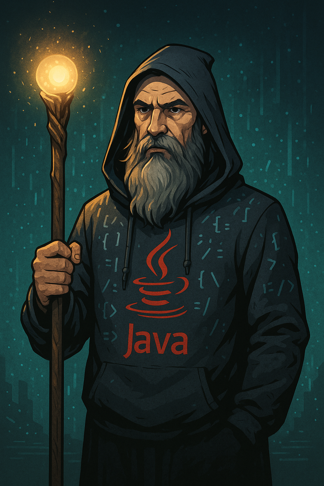

    preview do podcast

    <audio src="output/Podcast.MP3" controls title="Podcast editado"></audio>

# Projeto Podcast Gerado por I.A.s

Projeto com o objetivo de gerar um podcast utilizando ferramentas de IA através de prompts mais trabalhado.

Utilizer uma esteira de prompts para gerar cada etapa do processo criativo.

## 💻 Tecnologias utilizadas no projeto

- [ChatGPT](https://chat.openai.com/) 
- [Leonardo.AI](https://app.leonardo.ai/)
- [ElevenLabs](https://beta.elevenlabs.io/)
- [Capcut](https://www.capcut.com/pt-br/)

## ✨ Como foi feito ?

- Roteiro gerado via chatgpt
- Audio gerado pela elevenLabs
- Leonardo.AI Para gerar capas
- Capcut para tratar aúdio e adicionar sons de fundo

## 🛠️ Instruções de execução

- 🤖 1. Use os prompts de roteiro no `chagpt`
- 🤖 2. Use os prompts de roteiro gerados pelo chatgpt no  `ElevenLabs`
- 🤖 3. Use os prompts de artes no `Leonard.AI`

## 👨‍💻 Autor

    
    
Vinicius C. M. 
    

  

---

⌨️ com 💜 por Vinicius C. M.

---

⌨️ com 💜 por [Felipe Aguiar](https://github.com/felipeAguiarCode)
